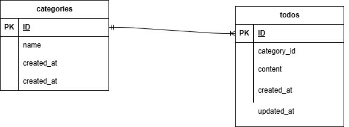

# お問い合わせフォーム

Todoを作ったり追加してくアプリ。また更新や削除、検索機能があるもの。

## 環境構築

#### リポジトリをクローン

```
git clone　git@github.com:asaumareru2-cmd/todo2.git
```

#### Laravelのビルド

```
docker-compose -up -d --build
```

#### Laravel パッケージのダウンロード

```
docker-compose exec php bash
```

```
composer install
```

#### .env ファイルの作成

```
cp .env.example .env
```

#### .env ファイルの修正

```
DB_HOST=mysql
DB_DATABASE=laravel_db
DB_USERNAME=laravel_user
DB_PASSWORD=laravel_pass
```

#### キー生成

```
php artisan key;generate
```

#### マイグレーション・シーディングを実行

```
◯◯◯◯◯ ◯◯◯◯ ◯◯◯◯
```

## 使用技術（実行環境）

フレームワーク：laravel

言語：日本語

Webサーバー：Nginx

データベース：mysql

## ER図



## URL

アプリケーション：http://localhost

管理画面：

phpMyAdmin：http://localhost:8080
